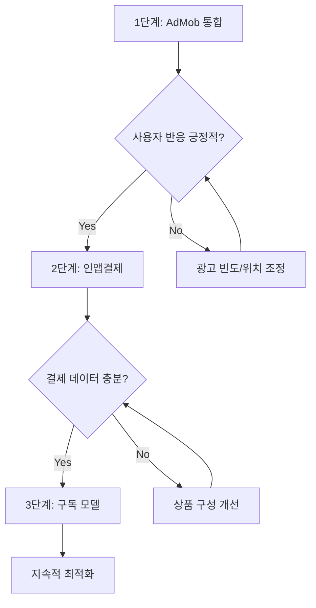

# EmotionTok 수익화 전략 로드맵

## 개요

EmotionTok은 감정을 익명으로 표현하고 커뮤니티와 공유하는 앱입니다. 사용자 경험을 해치지 않으면서 지속 가능한 수익 모델을 구축하기 위한 3단계 전략을 제시합니다.

## 핵심 원칙

> [!IMPORTANT]
> **사용자 경험 우선**: 수익화가 앱의 핵심 가치(감정 표현의 자유, 익명성, 위로)를 해치지 않아야 합니다.

1. **점진적 도입**: 단계별로 도입하여 사용자 반응 확인
2. **선택적 참여**: 강제가 아닌 선택 기반 수익화
3. **가치 제공**: 돈을 지불할 만한 명확한 가치 제공

---

## 1단계: AdMob 광고 통합 (출시 직후)

### 목표

- 초기 수익 창출
- 사용자 데이터 수집 및 행동 패턴 분석
- 별도 결제 없이 모든 사용자가 앱 이용 가능

### 광고 배치 전략

#### 1.1 배너 광고 (Banner Ads)

**위치**:

- 도서관(Library) 화면 하단
- 광장(Square) 스크롤 피드 상단 또는 하단

**특징**:

- 항상 표시되지만 콘텐츠 방해 최소화
- eCPM 낮음 (₩100-500)

#### 1.2 전면 광고 (Interstitial Ads)

**표시 시점**:

- 글 작성 완료 후 (AI 위로 받기 전)
- 3-5개 게시글 읽은 후 (광장)
- 앱 재실행 시 (단, 1일 1회로 제한)

**특징**:

- eCPM 높음 (₩1,000-3,000)
- 사용자 경험에 영향 큼 → 빈도 조절 필수

#### 1.3 보상형 광고 (Rewarded Ads) ⭐ 추천

**제공 보상**:

- 장작 +2개
- 물 +2개
- AI 위로 1회 추가 (하루 제한 초과 시)

**표시 위치**:

- 설정 화면 "보상 받기" 버튼
- 장작/물 소진 시 "광고 보고 충전하기" 버튼

**특징**:

- eCPM 매우 높음 (₩3,000-8,000)
- 사용자가 자발적으로 시청
- 앱 가치를 훼손하지 않음

### 구현 절차

#### Step 1: AdMob 계정 설정

```bash
1. Google AdMob 콘솔 접속 (https://admob.google.com)
2. 앱 등록 (Android/iOS)
3. 광고 단위 ID 발급:
   - Banner Ad Unit
   - Interstitial Ad Unit
   - Rewarded Ad Unit
```

#### Step 2: Flutter 패키지 추가

```yaml
# pubspec.yaml
dependencies:
  google_mobile_ads: ^5.0.0
```

#### Step 3: 초기화 코드 작성

```dart
// lib/services/ad_service.dart
import 'package:google_mobile_ads/google_mobile_ads.dart';

class AdService {
  static final AdService _instance = AdService._internal();
  factory AdService() => _instance;
  AdService._internal();

  Future<void> initialize() async {
    await MobileAds.instance.initialize();
  }

  // 배너, 전면, 보상형 광고 로드 메서드
}
```

#### Step 4: 광고 표시 구현

- 각 화면에 광고 위젯 배치
- 빈도 제한 로직 구현 (SharedPreferences)
- 사용자 피드백 수집

### 예상 수익 (월 MAU 1만 기준)

- 배너 광고: ₩50,000 - 100,000
- 전면 광고: ₩100,000 - 300,000
- 보상형 광고: ₩200,000 - 500,000
- **총 예상**: ₩350,000 - 900,000/월

---

## 2단계: 인앱결제 및 포인트 상점 (출시 1-2개월 후)

### 목표

- 직접 수익 확보
- 충성 사용자에게 프리미엄 경험 제공
- 광고를 원하지 않는 사용자에게 대안 제시

### 상품 구성

#### 2.1 소모품 (Consumable)

| 상품명           | 내용                     | 가격   | 가치                 |
| ---------------- | ------------------------ | ------ | -------------------- |
| 장작 꾸러미 (소) | 장작 20개                | ₩1,100 | 광고 5회 시청 가치   |
| 장작 꾸러미 (중) | 장작 50개 + 보너스 10개  | ₩2,200 | 20% 할인             |
| 장작 꾸러미 (대) | 장작 120개 + 보너스 30개 | ₩4,400 | 25% 할인             |
| 물 꾸러미 (소)   | 물 20개                  | ₩1,100 |                      |
| 물 꾸러미 (중)   | 물 50개 + 보너스 10개    | ₩2,200 |                      |
| 물 꾸러미 (대)   | 물 120개 + 보너스 30개   | ₩4,400 |                      |
| AI 위로 팩       | AI 위로 10회             | ₩3,300 | Gemini API 비용 감안 |

#### 2.2 비소모품 (Non-Consumable)

| 상품명           | 내용                      | 가격   |
| ---------------- | ------------------------- | ------ |
| 프리미엄 폰트 팩 | 특별한 손글씨 폰트 5종    | ₩2,200 |
| 특별 테마        | 다크모드 외 컬러 테마 3종 | ₩1,100 |
| 프로필 뱃지      | 광장에서 눈에 띄는 뱃지   | ₩1,100 |

### 구현 절차

#### Step 1: Google Play Console 설정

```bash
1. Google Play Console → 수익 창출 → 제품 → 인앱 상품
2. 각 상품 등록 (제품 ID, 가격, 설명)
3. 결제 프로필 설정 (은행 계좌, 세금 정보)
```

#### Step 2: Flutter 패키지 추가

```yaml
# pubspec.yaml
dependencies:
  in_app_purchase: ^3.1.0
```

#### Step 3: 결제 로직 구현

```dart
// lib/services/purchase_service.dart
import 'package:in_app_purchase/in_app_purchase.dart';

class PurchaseService {
  // 상품 목록 가져오기
  // 구매 처리
  // 구매 복원 (비소모품)
  // 영수증 검증 (서버 필요 시)
}
```

#### Step 4: 상점 UI 구현

- 설정 화면에 "상점" 메뉴 추가
- 상품 목록 표시
- 구매 확인 다이얼로그
- 구매 완료 후 보상 지급

### 예상 수익 (월 MAU 1만, 전환율 2% 기준)

- 월 결제 유저: 200명
- 평균 결제 금액: ₩3,000
- **총 예상**: ₩600,000/월

---

## 3단계: 프리미엄 구독 모델 (출시 3-6개월 후)

### 목표

- 안정적인 반복 수익(MRR) 확보
- VIP 사용자층 형성
- 앱 충성도 극대화

### 구독 플랜

#### 3.1 EmotionTok Plus (월 ₩3,900 / 연 ₩39,000)

**혜택**:

- ✅ 모든 광고 제거
- ✅ AI 위로 무제한 (또는 하루 10회)
- ✅ 장작/물 매일 10개씩 자동 충전
- ✅ 프리미엄 폰트 전체 이용
- ✅ 광장에서 프리미엄 뱃지 표시
- ✅ 글 작성 시 사진 3장까지 첨부 (무료는 1장)
- ✅ 도서관 통계 상세 분석 (감정 그래프, 키워드 클라우드)

#### 3.2 EmotionTok Pro (월 ₩9,900 / 연 ₩99,000)

**Plus 혜택 포함 +**:

- ✅ AI 페르소나 커스터마이징 (나만의 위로 캐릭터)
- ✅ 우선 고객 지원
- ✅ 출시 예정 기능 조기 접근
- ✅ 프라이빗 그룹 채팅 (소규모 비밀 커뮤니티)

### 구현 절차

#### Step 1: Google Play Billing 구독 설정

```bash
1. Google Play Console → 구독 제품 등록
2. 무료 체험 설정 (7일 권장)
3. 가격 책정 (₩3,900, ₩9,900)
```

#### Step 2: 구독 관리 시스템

```dart
// lib/services/subscription_service.dart
class SubscriptionService {
  // 구독 상태 확인
  // 구독 갱신/취소 처리
  // 혜택 활성화/비활성화
  // 서버와 영수증 동기화 (필수)
}
```

#### Step 3: 기능 잠금 해제

- UserViewModel에 isPremium, isPro 플래그 추가
- 각 기능에서 구독 상태 확인 후 UI/기능 제어
- 구독 만료 시 graceful degradation

#### Step 4: 서버 구축 (필수) ⚠️

> [!CAUTION]
> 구독은 클라이언트 조작 위험이 크므로 **서버 검증 필수**입니다.

**Firebase Functions 활용**:

```javascript
// functions/index.js
exports.verifySubscription = functions.https.onCall(async (data, context) => {
  // Google Play Developer API로 영수증 검증
  // Firestore에 구독 상태 저장
  // 만료 시 자동 갱신 또는 해지 처리
});
```

### 예상 수익 (월 MAU 1만, 구독 전환율 1% 기준)

- Plus 구독자: 80명 × ₩3,900 = ₩312,000
- Pro 구독자: 20명 × ₩9,900 = ₩198,000
- **총 예상**: ₩510,000/월 (MRR)

---

## 통합 수익 예측 (MAU 1만 기준)

| 단계     | 수익원     | 월 수익                    | 비고    |
| -------- | ---------- | -------------------------- | ------- |
| 1단계    | AdMob 광고 | ₩350,000 - 900,000         | 변동 큼 |
| 2단계    | 인앱결제   | ₩600,000                   | 일회성  |
| 3단계    | 구독 (MRR) | ₩510,000                   | 안정적  |
| **합계** |            | **₩1,460,000 - 2,010,000** |         |

### 비용 고려사항

- Gemini API: 사용량에 따라 월 ₩100,000 - 500,000 (무료 할당량 초과 시)
- Firebase: 월 ₩50,000 - 200,000 (Firestore, Functions)
- 서버/호스팅: 월 ₩0 - 100,000 (Firebase 무료 플랜으로 시작 가능)
- **순수익**: ₩1,210,000 - 1,210,000/월

---

## 추가 전략

### A. 이벤트 및 프로모션

- 신규 가입 7일간 프리미엄 무료 체험
- 친구 초대 시 장작/물 보상
- 특정 기간 할인 (예: 연말연시 30% 할인)

### B. 데이터 기반 최적화

- Firebase Analytics로 사용자 행동 분석
- A/B 테스트: 광고 빈도, 상품 가격, 구독 혜택
- 이탈 시점 파악 및 개선

### C. 정책 및 법적 준비

- 개인정보 처리방침 업데이트 (광고/결제 관련)
- 환불 정책 명시
- 청소년 보호 (19세 미만 결제 제한 고려)

---

## 구현 우선순위



### 타임라인

- **1주차**: AdMob 통합 및 테스트
- **2-4주차**: 광고 최적화 및 사용자 피드백 수집
- **5-8주차**: 인앱결제 구현 및 상점 오픈
- **12주차 이후**: 구독 모델 준비 및 출시

---

## 체크리스트

### AdMob (1단계)

- [ ] AdMob 계정 생성 및 앱 등록
- [ ] 광고 단위 ID 발급 (Banner, Interstitial, Rewarded)
- [ ] `google_mobile_ads` 패키지 추가
- [ ] 광고 초기화 코드 작성
- [ ] 각 화면에 광고 위젯 배치
- [ ] 광고 빈도 제한 로직 구현
- [ ] 개인정보 처리방침 업데이트 (광고 SDK 사용 명시)

### 인앱결제 (2단계)

- [ ] Google Play Console에 인앱 상품 등록
- [ ] 결제 프로필 설정 (은행 계좌, 세금 정보)
- [ ] `in_app_purchase` 패키지 추가
- [ ] PurchaseService 구현
- [ ] 상점 UI 구현
- [ ] 영수증 검증 로직 (서버 또는 클라이언트)
- [ ] 환불 정책 작성

### 구독 (3단계)

- [ ] Google Play Console에 구독 상품 등록
- [ ] 무료 체험 기간 설정
- [ ] Firebase Functions 서버 검증 로직 구현
- [ ] SubscriptionService 구현
- [ ] 프리미엄 기능 잠금 해제 로직
- [ ] 구독 관리 페이지 UI
- [ ] 만료 처리 및 자동 갱신 테스트

---

## 참고 자료

- [Google AdMob Flutter 공식 문서](https://developers.google.com/admob/flutter/quick-start)
- [In-App Purchase Flutter 패키지](https://pub.dev/packages/in_app_purchase)
- [Google Play Billing 가이드](https://developer.android.com/google/play/billing)
- [Firebase Functions로 영수증 검증하기](https://firebase.google.com/docs/functions)
